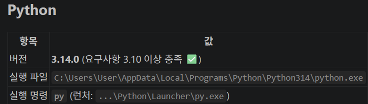
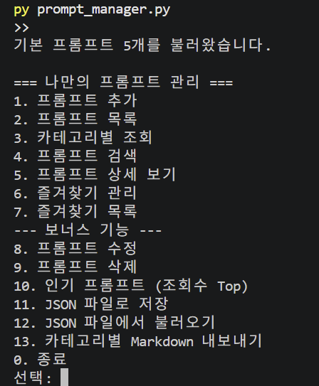
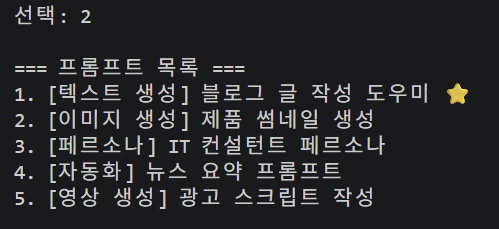
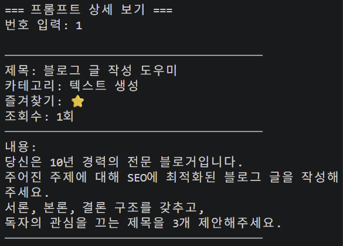
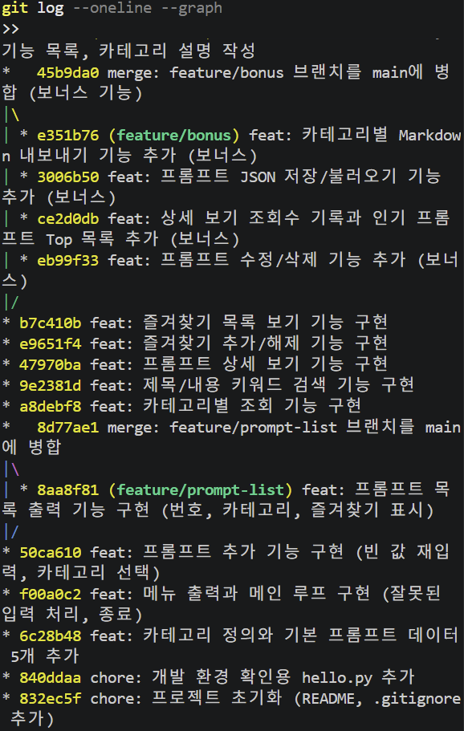

# 나만의 프롬프트 관리 프로그램

터미널에서 메뉴 번호를 입력해 프롬프트를 관리하는 **콘솔 기반 파이썬 프로그램**입니다.
자주 쓰는 AI 프롬프트를 등록해 두고 목록 / 카테고리 / 검색 / 즐겨찾기로 빠르게 찾아 쓸 수 있습니다.

- 외부 라이브러리 없이 파이썬 표준 문법만 사용합니다.
- 데이터는 리스트 + 딕셔너리로 저장하며, 프로그램 실행 중에만 유지됩니다. (종료하면 초기화)
- 보너스 기능인 JSON 저장 / 불러오기를 사용하면 종료 후에도 데이터를 다시 불러올 수 있습니다.

## 저장소

- **GitHub 저장소**: https://github.com/ChanWatermelon/A1-1
- 기본 브랜치: `main`

```bash
git clone https://github.com/ChanWatermelon/A1-1.git
cd A1-1
```

## 개발 환경

| 항목 | 값 |
| --- | --- |
| OS | Windows 11 |
| 편집기 | VSCode 1.131.0 |
| VSCode 확장 | Python (`ms-python.python`), Pylance, Python Debugger |
| Python | **3.14.0** (요구사항: 3.10 이상) |
| Python 실행 명령 | `py` (Windows Python Launcher) |
| Git | **git version 2.52.0.windows.1** |
| `git config user.name` | `deoggong0411` |
| `git config user.email` | `deoggong0411@gmail.com` |
| `git config init.defaultBranch` | `main` |

환경은 아래 명령으로 확인할 수 있습니다.

```powershell
py --version              # Python 3.14.0
git --version             # git version 2.52.0.windows.1
git config --global --list
```

```
user.name=deoggong0411
user.email=deoggong0411@gmail.com
init.defaultbranch=main
```



> 윈도우에서 `python`은 스토어 별칭으로 잡히는 경우가 있어 이 프로젝트에서는 `py` 명령을 사용합니다.
> 파이썬 실행 확인(`print("Hello")`)은 `hello.py`로 진행했으며, 확인 후 정리해 커밋 기록에만 남아 있습니다. (`840ddaa chore: 개발 환경 확인용 hello.py 추가`)

## 실행 방법

```bash
git clone https://github.com/ChanWatermelon/A1-1.git
cd A1-1
py prompt_manager.py        # 윈도우 이외 환경: python3 prompt_manager.py
```

VSCode에서는 `prompt_manager.py`를 열고 오른쪽 위 ▶ (Run Python File) 버튼을 눌러도 실행됩니다.

실행하면 메뉴가 나타나고 번호를 입력해 기능을 선택합니다.
잘못된 번호를 입력하면 안내 메시지를 보여 준 뒤 다시 메뉴로 돌아오고, `0`을 누르면 종료됩니다.

## 실행 화면

| 메뉴 | 프롬프트 목록 |
| --- | --- |
|  |  |

| 상세 보기 | 커밋 그래프 |
| --- | --- |
|  |  |

## 기능 목록

### 필수 기능

| 번호 | 기능 | 설명 |
| --- | --- | --- |
| 1 | 프롬프트 추가 | 제목·내용·카테고리를 입력해 새 프롬프트를 등록합니다. 값이 비어 있으면 다시 입력을 요청하고, 즐겨찾기 기본값은 `False`입니다. |
| 2 | 프롬프트 목록 | 저장된 모든 프롬프트를 번호·카테고리·제목·즐겨찾기(⭐)와 함께 출력합니다. |
| 3 | 카테고리별 조회 | 카테고리를 고르면 해당 카테고리의 프롬프트만 보여 줍니다. |
| 4 | 프롬프트 검색 | 키워드가 제목 또는 내용에 들어 있는 프롬프트를 찾아 줍니다. (대소문자 구분 없음) |
| 5 | 프롬프트 상세 보기 | 번호를 입력하면 제목·카테고리·즐겨찾기·조회수·내용 전체를 보여 줍니다. |
| 6 | 즐겨찾기 관리 | 번호를 입력해 즐겨찾기를 추가하거나 해제합니다. |
| 7 | 즐겨찾기 목록 | 즐겨찾기한 프롬프트만 모아서 보여 줍니다. |
| 0 | 종료 | 프로그램을 끝냅니다. |

### 보너스 기능

| 번호 | 기능 | 설명 |
| --- | --- | --- |
| 8 | 프롬프트 수정 | 제목·내용·카테고리를 고쳐 씁니다. (엔터만 누르면 기존 값 유지) |
| 9 | 프롬프트 삭제 | 확인 후 프롬프트를 목록에서 지웁니다. |
| 10 | 인기 프롬프트 | 상세 보기 횟수(조회수) 기준으로 정렬한 Top 목록을 보여 줍니다. |
| 11 | JSON 저장 | 현재 프롬프트 전체를 `prompts.json`으로 저장합니다. |
| 12 | JSON 불러오기 | `prompts.json`을 읽어 현재 목록을 교체합니다. |
| 13 | Markdown 내보내기 | 카테고리별로 `export/카테고리.md` 파일을 만들어 줍니다. |

## 프롬프트 카테고리

기본으로 제공하는 카테고리는 6가지이며, 프롬프트 추가 시 목록에서 고르거나 직접 입력할 수 있습니다.

| 카테고리 | 설명 | 기본 등록 프롬프트 |
| --- | --- | --- |
| 텍스트 생성 | 글쓰기·요약·번역 등 문장을 만들어 내는 프롬프트 | 블로그 글 작성 도우미 |
| 이미지 생성 | 이미지 생성 AI에 넣는 화풍·구도·비율 지시 프롬프트 | 제품 썸네일 생성 |
| 영상 생성 | 영상 스크립트·장면 구성용 프롬프트 | 광고 스크립트 작성 |
| 페르소나 | AI에게 특정 역할과 말투를 부여하는 프롬프트 | IT 컨설턴트 페르소나 |
| 자동화 | 반복 업무를 정해진 형식으로 처리하는 프롬프트 | 뉴스 요약 프롬프트 |
| 기타 | 위 분류에 넣기 어려운 프롬프트 | - |

## 데이터 구조

프롬프트 한 개는 **딕셔너리**, 전체 프롬프트는 **리스트**에 담아 관리합니다.

```python
prompts = [
    {
        "title": "블로그 글 작성 도우미",
        "content": "당신은 10년 경력의 전문 블로거입니다...",
        "category": "텍스트 생성",
        "favorite": True,
        "views": 0,
    },
]
```

### 리스트 · 딕셔너리 장단점 비교

| 구분 | 리스트 (전체 프롬프트) | 딕셔너리 (프롬프트 하나) |
| --- | --- | --- |
| 역할 | 프롬프트들을 **순서대로** 모아 둔다 | 한 프롬프트의 **속성**을 모아 둔다 |
| 장점 | 입력한 순서가 유지되어 메뉴의 "1번, 2번" 번호와 그대로 이어진다. `append`/`pop`으로 추가·삭제가 쉽고, `enumerate`·반복문·리스트 컴프리헨션으로 목록/검색/필터를 간단히 만들 수 있다 | `prompt["title"]`처럼 **이름으로** 값을 꺼내 코드가 읽기 쉽다. 값을 꺼내는 속도가 빠르고(평균 O(1)), `views` 같은 항목을 나중에 추가해도 기존 코드가 깨지지 않는다. `json.dump`로 그대로 저장된다 |
| 단점 | 특정 제목을 찾으려면 처음부터 끝까지 훑어야 한다(O(n)). 중간 항목을 지우면 뒤 번호가 전부 밀린다 | 키 이름을 오타 내면 `KeyError`가 난다. 항목마다 키 문자열이 반복 저장돼 메모리를 조금 더 쓴다. 정해진 형식을 강제하지 못해 키가 빠져도 실행 시점에야 알 수 있다 |
| 대안과 비교 | 딕셔너리(`{제목: 프롬프트}`)로 전체를 담으면 제목 검색은 빨라지지만 **번호로 고르는 메뉴 방식**과 맞지 않아 리스트를 선택 | 튜플이나 여러 개의 병렬 리스트로도 표현할 수 있지만, 순서를 외워야 하고 항목 추가가 어려워 딕셔너리를 선택 |

**정리**: 프롬프트 개수가 수십 개 수준이고 "번호를 입력해 고르는" 콘솔 프로그램이라, 조회 속도보다 **순서 유지와 코드 가독성**이 중요해 `리스트 + 딕셔너리` 조합을 사용했습니다.
단점인 키 오타·누락은 `make_prompt()` 함수 하나로만 프롬프트를 만들고, JSON 불러오기에서 `item.get("views", 0)`처럼 기본값을 주는 방식으로 보완했습니다.

## 중복 제목 처리 규칙

제목이 겹치면 목록에서 구분이 어려워지므로, **추가(1번)와 수정(8번)** 시 같은 제목이 있는지 먼저 확인합니다.

**중복 판단 기준**

- 앞뒤 공백과 중간 중복 공백을 없애고, 대소문자를 구분하지 않고 비교합니다. (`normalize_title()`)
  → `"블로그 글 작성 도우미"`, `"  블로그   글 작성 도우미  "`, `"블로그 글 작성 도우미"`(대소문자 혼용)는 모두 같은 제목으로 봅니다.
- 수정할 때는 자기 자신은 비교 대상에서 제외합니다. (제목을 그대로 두고 내용만 고칠 수 있어야 하므로)
- 내용·카테고리는 비교하지 않습니다. 같은 제목을 서로 다른 카테고리에 두는 것도 중복으로 봅니다.

**중복이 발견되면** 덮어쓰거나 조용히 저장하지 않고, 사용자에게 세 가지 중 하나를 고르게 합니다.

```
[알림] 같은 제목이 이미 있습니다 -> 1. [텍스트 생성] 블로그 글 작성 도우미 ⭐
1) 다른 제목으로 다시 입력
2) 뒤에 번호를 붙여 저장 (예: 제목 (2))
0) 취소
선택:
```

| 선택 | 동작 |
| --- | --- |
| 1) 다시 입력 | 새 제목을 받아 **다시 중복 검사**를 한다 (겹치지 않을 때까지 반복) |
| 2) 번호 붙이기 | `제목 (2)` → 그것도 있으면 `제목 (3)` … 비어 있는 번호를 찾아 저장한다 (`make_unique_title()`) |
| 0) 취소 | 아무것도 저장하지 않고 메뉴로 돌아간다 |

**예외**: JSON 불러오기(12번)는 파일에 저장된 내용을 그대로 복원하는 기능이므로 중복 검사를 하지 않습니다. 사용자가 직접 만든 파일의 내용을 프로그램이 임의로 바꾸지 않기 위해서입니다.

## 코드 구조

기능별로 함수를 나눠서 작성했습니다. (`prompt_manager.py`)

| 함수 | 역할 |
| --- | --- |
| `make_prompt()` / `load_default_prompts()` | 프롬프트 딕셔너리 생성, 기본 데이터 5개 반환 |
| `input_nonempty()` / `choose_category()` / `select_prompt_index()` | 입력값 검사와 선택 처리 |
| `normalize_title()` / `find_duplicate_title()` / `make_unique_title()` / `resolve_duplicate_title()` | 중복 제목 검사와 처리 |
| `format_prompt_line()` / `print_prompt_list()` | 목록 한 줄 만들기, 목록 출력 |
| `add_prompt()` / `show_list()` / `show_by_category()` | 추가, 전체 목록, 카테고리별 조회 |
| `search_prompt()` / `show_detail()` | 검색, 상세 보기 |
| `toggle_favorite()` / `show_favorites()` | 즐겨찾기 추가·해제, 즐겨찾기 목록 |
| `edit_prompt()` / `delete_prompt()` / `show_top_prompts()` | 보너스 - 수정, 삭제, 조회수 Top |
| `save_to_json()` / `load_from_json()` / `make_markdown()` / `export_markdown()` | 보너스 - 저장, 불러오기, Markdown 내보내기 |
| `show_menu()` / `main()` | 메뉴 출력, 메인 반복 루프 |

## 파일 구성

```
A1-1/
├── prompt_manager.py   # 프로그램 본체 (모든 기능)
├── README.md
├── .gitignore          # __pycache__, prompts.json, export/ 등 제외
└── docs/               # README에 쓰는 실행 화면 스크린샷
    ├── dev-environment.png
    ├── menu.png
    ├── list.png
    ├── detail.png
    └── git-log-graph.png
```

프로그램을 실행하면 `prompts.json`(11번 기능)과 `export/`(13번 기능)가 만들어질 수 있는데,
결과물이라 `.gitignore`로 제외했습니다.

## Git 작업 정책

### 커밋 기준

- **기능 단위로 커밋한다.** 커밋 하나 = 동작하는 기능 하나. "메뉴 출력", "검색 기능"처럼 되돌리기(revert)해도 프로그램이 망가지지 않는 크기로 나눕니다.
- **실행해서 확인한 것만 커밋한다.** 커밋 전에 `py prompt_manager.py`로 해당 기능을 직접 실행해 봅니다.
- **관련 없는 변경을 섞지 않는다.** 기능 코드와 README 수정은 서로 다른 커밋으로 남깁니다.
- **메시지는 `타입: 무엇을 왜` 형식으로 쓴다.** 제목만 읽어도 변경 의도가 보이게 합니다.

| 타입 | 사용하는 경우 | 예시 |
| --- | --- | --- |
| `feat` | 기능 추가 | `feat: 제목/내용 키워드 검색 기능 구현` |
| `docs` | 문서 작업 | `docs: README에 실행 방법, 기능 목록 작성` |
| `chore` | 설정·환경 등 기능 외 작업 | `chore: 프로젝트 초기화 (README, .gitignore 추가)` |
| `merge` | 브랜치 병합 | `merge: feature/bonus 브랜치를 main에 병합` |

### 브랜치 분리 기준과 병합 시점

| 브랜치 | 역할 | 규칙 |
| --- | --- | --- |
| `main` | 항상 실행되는 상태만 유지 | 완성되지 않은 기능을 직접 커밋하지 않는다 |
| `feature/*` | 기능 개발 | 기능 이름을 브랜치 이름에 쓴다 (`feature/prompt-list`) |

- **분리 기준**: ① 커밋이 여러 개 필요한 기능이거나, ② 만들다 실패해도 `main`에 영향을 주면 안 되는 작업이면 브랜치를 나눕니다. 오타 수정처럼 커밋 하나로 끝나는 작업은 `main`에서 바로 처리합니다.
- **병합 시점**: 기능이 **완성되고 직접 실행해 확인한 뒤**에 병합합니다. 중간 상태로는 병합하지 않습니다.
- **병합 방법**: `git merge --no-ff`를 사용합니다. Fast-forward로 합치면 브랜치에서 작업한 흔적이 사라져서, 병합 커밋을 남겨 `git log --graph`에 갈라졌다 합쳐진 기록이 보이도록 했습니다.

```bash
git checkout -b feature/prompt-list   # 브랜치 생성 + 이동
# ... 기능 개발 & 커밋 ...
git checkout main
git merge --no-ff feature/prompt-list -m "merge: feature/prompt-list 브랜치를 main에 병합"
```

### 실제 브랜치 작업 기록

- `feature/prompt-list` : 프롬프트 목록 기능을 개발한 뒤 `main`에 병합
- `feature/bonus` : 보너스 기능(수정/삭제/조회수/JSON/Markdown)을 개발한 뒤 `main`에 병합

```bash
git log --oneline --graph
```

## 병합 충돌(merge conflict) 대응 절차

브랜치와 `main`에서 **같은 파일의 같은 줄**을 서로 다르게 고치면 Git이 자동으로 합치지 못하고 충돌이 납니다.
이 프로젝트는 `prompt_manager.py` 한 파일에 기능을 이어 붙이는 구조라, 특히 `show_menu()`와 `main()`의 메뉴 분기에서 충돌이 나기 쉽습니다.

### 1단계 · 원인 확인

```bash
git merge --no-ff feature/bonus     # CONFLICT (content): Merge conflict in prompt_manager.py
git status                          # "both modified: prompt_manager.py" 확인
git diff                            # 어느 부분이 충돌했는지 확인
```

충돌한 파일에는 아래 표시가 들어갑니다.

```
<<<<<<< HEAD
    print("7. 즐겨찾기 목록")          ← 현재 브랜치(main)의 내용
=======
    print("7. 즐겨찾기 목록")
    print("8. 프롬프트 수정")          ← 병합하려는 브랜치(feature/bonus)의 내용
>>>>>>> feature/bonus
```

주 원인은 ① 두 브랜치에서 같은 함수를 동시에 수정, ② 브랜치를 오래 두어 `main`이 많이 앞서 나간 경우입니다.

### 2단계 · 해결

1. 충돌 파일을 열어 `<<<<<<<`, `=======`, `>>>>>>>` **세 줄을 모두 지우고** 최종적으로 남길 코드만 남깁니다.
   → 보통 한쪽을 버리는 게 아니라 **양쪽 내용을 합치는 것**이 맞습니다. (위 예시라면 7번과 8번 메뉴 모두 남김)
2. VSCode에서는 충돌 부분 위에 뜨는 `Accept Current` / `Accept Incoming` / `Accept Both` 버튼을 쓰면 편합니다.
3. 정리한 파일을 저장하고 스테이징한 뒤 병합 커밋을 만듭니다.

```bash
git add prompt_manager.py
git commit                     # 병합 커밋 메시지 작성
```

되돌리고 싶으면 병합 전 상태로 돌아갈 수 있습니다.

```bash
git merge --abort
```

### 3단계 · 검증

```bash
py prompt_manager.py           # 실제로 실행해서 메뉴 1~13번이 모두 동작하는지 확인
git log --oneline --graph      # 병합 커밋이 제대로 생겼는지 확인
git status                     # 처리되지 않은 충돌 파일이 없는지 확인
```

**중요**: 충돌 표시만 지우고 커밋하면 문법은 맞아도 기능이 빠져 있을 수 있습니다.
반드시 프로그램을 실행해 **양쪽 브랜치의 기능이 모두 살아 있는지** 확인한 뒤 push 합니다.

### 예방

- 브랜치를 오래 끌지 않고 기능이 끝나면 바로 병합합니다.
- 작업을 시작하기 전 `git pull`로 최신 `main`을 받아 둡니다.
- 한 브랜치에서는 한 가지 기능만 건드립니다.
